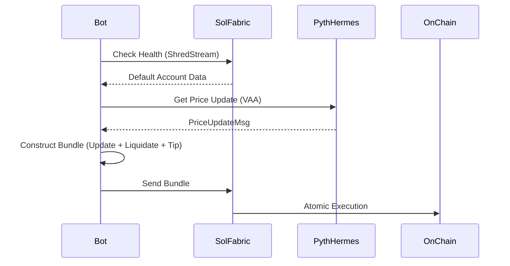

# Atomliq Design Document

## 1. Overview
Atomliq is a high-performance liquidation engine designed to protect lending protocols by executing liquidations with zero "stale price" risk (TOCTTOU). It utilizes a "Pull Oracle" architecture combined with atomic bundles.

## 2. Core Logic

### 2.1 The Two-Step Atomic Transaction
Atomliq transactions are designed to effectively "atomicize" the oracle update and the liquidation.

1.  **Instruction 1: Update Price**: Calls Pyth Pull Oracle to update the on-chain price feed to the latest value.
2.  **Instruction 2: Execute Liquidation**: Checks the newly updated price. If the account is unhealthy, it performs the liquidation.
3.  **Instruction 3: Jito Tip**: Pay the validator for inclusion.

These 3 instructions MUST be in the same Jito Bundle (or same transaction if size permits) to guarantee the price used for liquidation is the exact one intended.

### 2.2 Program Architecture (Anchor)
-   `execute_liquidation`:
    -   **Inputs**: `amount_in`, `max_allowed_ltv`.
    -   **Context**:
        -   `price_update`: Pyth `PriceUpdateV2` account.
        -   `user_account`: The borrower to be liquidated.
        -   `liquidator`: The signer.
    -   **Logic**:
        -   Read price `P` from `price_update`.
        -   Calculate Health Factor `HF` based on `P`.
        -   If `HF < 1.0`, seize collateral and burn debt.
        -   If `HF >= 1.0`, revert (saving the liquidator from bad execution).

## 3. Integration with SolFabric
Atomliq relies on **SolFabric** to fetch the "Price Update Message" (VAA) from Pyth's off-chain price service and bundler construction.

## 4. Future Enhancements
-   **Flash Loan Integration**: Borrow funds atomically to liquidate large positions without capital requirements.
-   **Inventory Management**: Auto-swap seized collateral back to the debt token via Jupiter.
