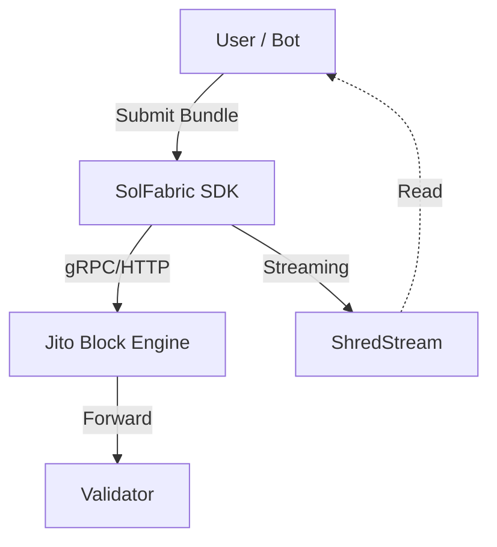

# SolFabric Design Document

## 1. Overview
SolFabric is the underlying infrastructure layer that provides "Inclusion Assurance" and high-performance execution for Solana DeFi applications. It acts as a bridge between off-chain bots/users and on-chain validators, leveraging Jito Bundles and ShredStream for maximum velocity.

## 2. Architecture

### 2.1 Component Diagram


### 2.2 Key Components
1.  **SolFabric SDK (B2D)**:
    -   **Bundle Submission**: methods to construct and send `JitoBundle` objects.
    -   **Tip Management**: Auto-calculation of tips based on network congestion (future).
    -   **ShredStream Client**: A gRPC client for reading partial blocks to get account updates faster than standard RPC `getAccountInfo`.

2.  **Inclusion Assurance**:
    -   Leverage Jito's `SendBundle` endpoint to guarantee transaction sets (e.g., Oracle Update + Action + Tip) are atomic.
    -   Prevents "landed but failed" scenarios typical in high-congestion.

## 3. Data Flow
1.  **Market Event**: ShredStream detects an on-chain event (e.g., price update or health factor drop).
2.  **Reaction**: Bot calculates the necessary transaction.
3.  **Bundle Construction**: Bot adds a Jito Tip instruction to the transaction.
4.  **Submission**: Bundle sent to Jito Block Engine.
5.  **Confirmation**: Block Engine forwards to Leader; execution confirmed via signature subscription.

## 4. API Interface (Draft)
```typescript
interface JitoBundle {
  transactions: VersionedTransaction[];
  tip: number; // Lamports
}

class SolFabric {
  async sendBundle(bundle: JitoBundle): Promise<BundleResult>;
  async onShred(account: PublicKey, callback: (data: Buffer) => void): void;
}
```
